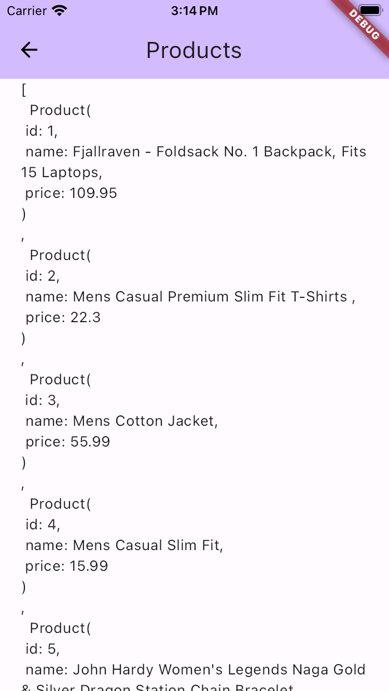

# Example for Connect Fake Store Package

This example demonstrates how to use the connect_fake_store package to interact with a mock store's API to fetch categories and products.

## Overview

The example consists of:

- main.dart: Entry point of the Flutter application where MyApp and MyHomePage widgets are defined.
- home_page.dart: Displays options to fetch categories and products using HomeProvider and Provider.
- products_page.dart: Displays fetched products in  ProductsPage.
- categories_page.dart: Displays fetched categories using CategoriesPage.
- main_provider.dart: Implements HomeProvider to manage state and fetch data using ConnectFakeStore.


## How to Run

Follow these steps to run the example:

1. Clone this repository:

```bash
git clone https://github.com/sharfe25/connect_fake_store.git
```

2. Navigate to the example directory:

```bash
cd connect_fake_store/example
```

3. Install dependencies:

```bash
flutter pub get
```

4. Run the example on a connected device or emulator:
```bash
flutter run
```

5. Explore the example:

- The home page (HomePage) displays options to fetch categories and products.
- Tap on "Categories" or "Products" to fetch and display corresponding data.
- The fetched categories are displayed in CategoriesPage, and products are displayed in ProductsPage.

## Screenshots




## License
This example is licensed under the MIT License. See the [LICENSE] (https://choosealicense.com/licenses/mit/) file for more details.

